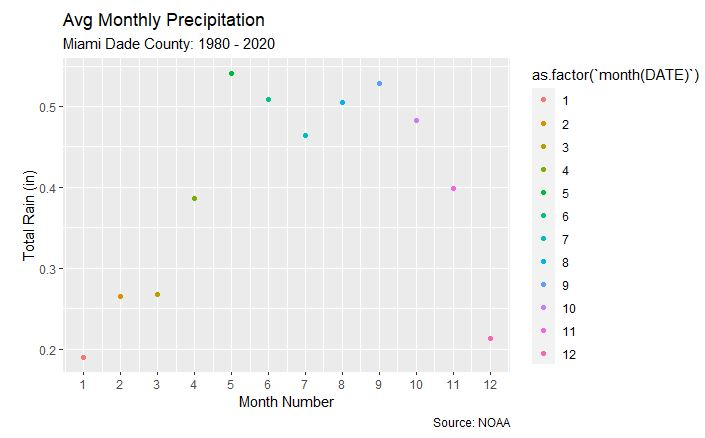

# Authors
Rene Villarreal
Raul Ramon
Xiomara Chirinos

# Fundamentals of Big Data Final Project

Our final project was built in R Studio.\

There are three main folders: **Code**, **Data**, and **Documents**

**Code**: Contains the .rmd file used to create the project\
**Data**: Contains part of the dataset in CSV format, and a link to the full data set in DropBox\
**Documents**: Contains our final powerpoint presentation and our original pitch slides along with a word document with questions and answers

# Dataset

The data used for this project is from NOAA. We used data for the United States by County from 1980 to 2020. The dataset is for climate change. Contains variables like precipitation, sunshine and temperature.

# Summary

Our project contains exploratory analysis to understand what the data looks like. Below is a boxplot that shows the average temperature at different rain levels by county:

And below is the average temperature by county in a bargraph.

We also predicted some data using a loess model for rain using temperature as the independent variable:

Our project also contains some time-series analysis with ARIMA models that show average temperature and forecasts:

